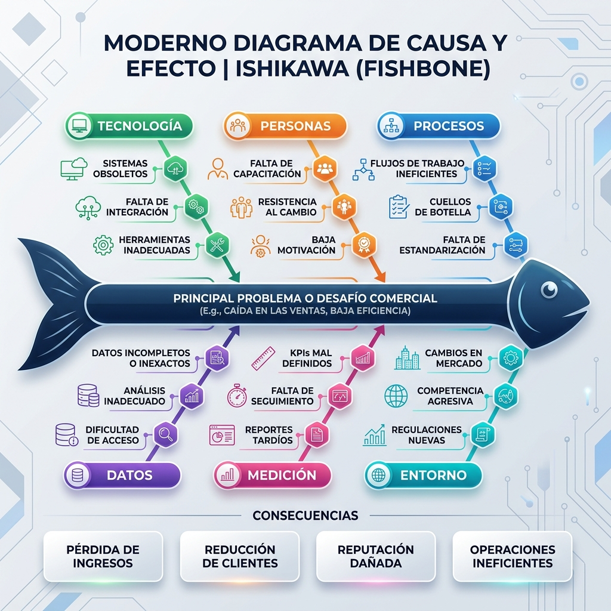
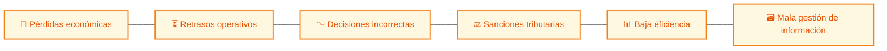

# 🎨 DIAGRAMA DE ESPINA DE PESCADO (ISHIKAWA)

*Diagrama generado basado en los requerimientos.*

---

# PROMPT VISUAL — DIAGRAMA DE ESPINA DE PESCADO PREMIUM 
## Sistema Inteligente de Monitoreo de Facturación con IA

```mermaid
flowchart LR

%% =========================
%% ESTILOS
%% =========================
classDef tech fill:#E8F5E9,stroke:#2E7D32,color:#1B5E20,stroke-width:2px;
classDef people fill:#FFF3E0,stroke:#EF6C00,color:#E65100,stroke-width:2px;
classDef process fill:#E3F2FD,stroke:#1565C0,color:#0D47A1,stroke-width:2px;
classDef data fill:#F3E5F5,stroke:#7B1FA2,color:#4A148C,stroke-width:2px;
classDef measure fill:#FCE4EC,stroke:#C2185B,color:#880E4F,stroke-width:2px;
classDef env fill:#E0F7FA,stroke:#00838F,color:#006064,stroke-width:2px;
classDef problem fill:#ECEFF1,stroke:#263238,color:#111,stroke-width:3px;

%% =========================
%% PROBLEMA CENTRAL
%% =========================
P([🚨 DETECCIÓN TARDÍA O INADECUADA <br> DE IRREGULARIDADES EN LOS <br> PROCESOS DE FACTURACIÓN <br> DE PEQUEÑAS EMPRESAS]):::problem

%% =========================
%% TECNOLOGÍA
%% =========================
T1["💻 Sistemas tradicionales <br> sin IA"]:::tech
T2["⚙️ Herramientas manuales <br> propensas a errores"]:::tech
T3["🤖 Falta de automatización"]:::tech
T4["🔗 Integración limitada <br> entre sistemas"]:::tech

T1 --> P
T2 --> P
T3 --> P
T4 --> P

%% =========================
%% PERSONAS
%% =========================
PE1["👨‍💼 Falta de capacitación digital"]:::people
PE2["📊 Desconocimiento en <br> análisis de datos"]:::people
PE3["🔄 Resistencia al cambio"]:::people
PE4["📝 Dependencia manual"]:::people

PE1 --> P
PE2 --> P
PE3 --> P
PE4 --> P

%% =========================
%% PROCESOS
%% =========================
PR1["📑 Procesos no estandarizados"]:::process
PR2["🔍 Revisión manual de datos"]:::process
PR3["📡 Falta de monitoreo"]:::process
PR4["🚨 Sin alertas automáticas"]:::process

PR1 --> P
PR2 --> P
PR3 --> P
PR4 --> P

%% =========================
%% DATOS
%% =========================
D1["🗂️ Datos inconsistentes"]:::data
D2["📄 Información duplicada"]:::data
D3["✅ Sin validaciones automáticas"]:::data
D4["📚 Históricos desaprovechados"]:::data

D1 --> P
D2 --> P
D3 --> P
D4 --> P

%% =========================
%% MEDICIÓN
%% =========================
M1["📉 Indicadores poco precisos"]:::measure
M2["📈 Falta de métricas"]:::measure
M3["🧪 Sin evaluación del sistema"]:::measure
M4["📢 Impacto no medido"]:::measure

M1 --> P
M2 --> P
M3 --> P
M4 --> P

%% =========================
%% ENTORNO
%% =========================
E1["🏛️ Cambios tributarios"]:::env
E2["📜 Requisitos DIAN"]:::env
E3["🌐 Competencia digital limitada"]:::env
E4["🛡️ Riesgos de fraude"]:::env

E1 --> P
E2 --> P
E3 --> P
E4 --> P
```

---

# ⚠️ CONSECUENCIAS

