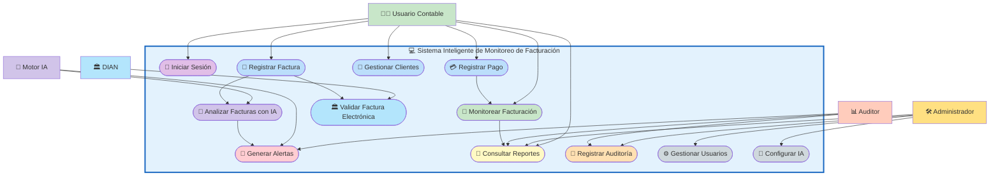

# 👥 Diagrama de Casos de Uso

## Sistema Inteligente de Monitoreo de Facturación con IA

### Vista General del Sistema

---

# 📌 Descripción del Diagrama

El siguiente diagrama representa gráficamente las interacciones entre los actores principales y las funcionalidades del **Sistema Inteligente de Monitoreo de Facturación con Inteligencia Artificial**.

## 👨‍💼 Actores Principales

| Actor | Descripción |
|---|---|
| Usuario Contable | Gestiona facturas, clientes y pagos |
| Administrador | Configura y administra el sistema |
| Auditor | Supervisa alertas, auditorías y reportes |
| Motor IA | Analiza automáticamente las facturas |
| DIAN | Valida las facturas electrónicas |

---

# ⚙️ Funcionalidades Principales

- Registro y monitoreo de facturas.
- Gestión de clientes y pagos.
- Análisis automático mediante IA.
- Detección de anomalías.
- Generación de alertas automáticas.
- Auditoría y reportes.
- Gestión de usuarios.
- Validación de facturación electrónica.

---

# 🎯 Objetivo del Diagrama

Este diagrama permite visualizar:

- La interacción entre usuarios y sistema.
- Los procesos automatizados con IA.
- El flujo principal de monitoreo contable.
- La organización funcional del software.
- Las responsabilidades de cada actor dentro del sistema.