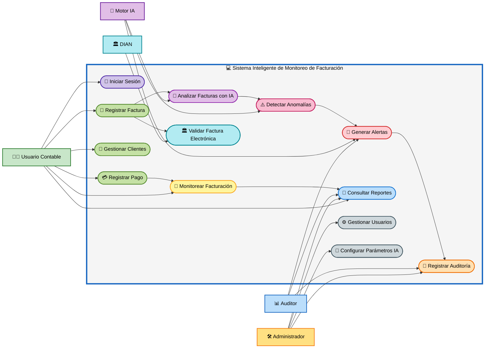

# 👥 Diagrama de Casos de Uso

# Sistema Inteligente de Monitoreo de Facturación con IA

## 📋 Vista General del Sistema

---

# 📌 Descripción del Diagrama

El diagrama representa gráficamente el funcionamiento general del **Sistema Inteligente de Monitoreo de Facturación con Inteligencia Artificial**, mostrando la interacción entre los usuarios, los módulos administrativos y el motor inteligente encargado del análisis de anomalías en facturación.

---

# 👨‍💼 Actores del Sistema

| Actor | Función |
|---|---|
| Usuario Contable | Gestiona facturas, clientes y pagos |
| Administrador | Configura y administra el sistema |
| Auditor | Supervisa reportes y alertas |
| Motor IA | Analiza datos y detecta anomalías |
| DIAN | Valida las facturas electrónicas |

---

# ⚙️ Funcionalidades Principales

- Registro de facturas.
- Gestión de clientes.
- Registro de pagos.
- Monitoreo de facturación.
- Detección de anomalías mediante IA.
- Generación de alertas automáticas.
- Gestión de auditorías.
- Administración del sistema.
- Validación de facturación electrónica.

---

# 🎯 Objetivo del Diagrama

Visualizar de manera clara:

- La interacción entre actores y sistema.
- Los procesos automáticos realizados por IA.
- El flujo principal del monitoreo contable.
- Los módulos administrativos y de auditoría.
- El funcionamiento general del software.