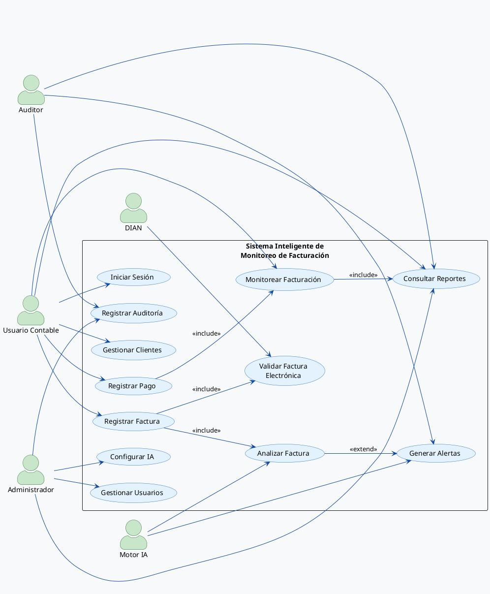

# Diagrama de Casos de Uso  
## Sistema Inteligente de Monitoreo de Facturación con IA

```plantuml
@startuml
left to right direction
skinparam backgroundColor #F8F9FA
skinparam actorStyle awesome
skinparam packageStyle rectangle
skinparam usecase {
    BackgroundColor #E3F2FD
    BorderColor #1565C0
    ArrowColor #0D47A1
    FontSize 14
}
skinparam actor {
    BorderColor #1B5E20
    BackgroundColor #C8E6C9
    FontSize 14
}

actor "Usuario Contable" as UC
actor "Administrador" as ADM
actor "Auditor" as AUD
actor "Motor IA" as IA
actor "DIAN" as DIAN

rectangle "Sistema Inteligente de\nMonitoreo de Facturación" {

  usecase "Iniciar Sesión" as U1
  usecase "Registrar Factura" as U2
  usecase "Gestionar Clientes" as U3
  usecase "Registrar Pago" as U4
  usecase "Analizar Factura" as U5
  usecase "Generar Alertas" as U6
  usecase "Consultar Reportes" as U7
  usecase "Gestionar Usuarios" as U8
  usecase "Registrar Auditoría" as U9
  usecase "Validar Factura\nElectrónica" as U10
  usecase "Monitorear Facturación" as U11
  usecase "Configurar IA" as U12

}

UC --> U1
UC --> U2
UC --> U3
UC --> U4
UC --> U7
UC --> U11

ADM --> U8
ADM --> U12
ADM --> U9
ADM --> U7

AUD --> U6
AUD --> U7
AUD --> U9

IA --> U5
IA --> U6

DIAN --> U10

U2 --> U5 : <<include>>
U5 --> U6 : <<extend>>
U4 --> U11 : <<include>>
U11 --> U7 : <<include>>
U2 --> U10 : <<include>>

@enduml
```