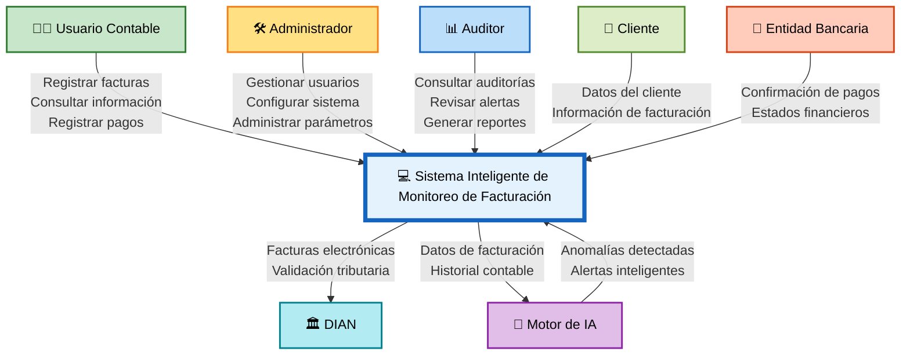

# 🌐 Diagrama de Contexto (DCA)

# Sistema Inteligente de Monitoreo de Facturación con IA

## 📋 Vista General del Contexto

---

# 📌 Descripción del Diagrama de Contexto

El Diagrama de Contexto (DCA) representa la interacción del **Sistema Inteligente de Monitoreo de Facturación con IA** con las entidades externas que participan directa o indirectamente en el funcionamiento del sistema.

Este diagrama permite identificar:

- Los actores externos que interactúan con el sistema.
- El flujo principal de información.
- Las entradas y salidas del sistema.
- Las conexiones con servicios externos como la DIAN y entidades bancarias.
- La integración del motor de Inteligencia Artificial.

---

# 👥 Entidades Externas

| Entidad | Función |
|---|---|
| Usuario Contable | Registra facturas, pagos y consultas |
| Administrador | Configura y administra el sistema |
| Auditor | Supervisa reportes y auditorías |
| Cliente | Proporciona información de facturación |
| Entidad Bancaria | Confirma pagos y movimientos financieros |
| DIAN | Valida facturación electrónica |
| Motor IA | Analiza datos y detecta anomalías |

---

# 🔄 Flujo Principal de Información

## Entradas al Sistema

- Datos de clientes.
- Facturas registradas.
- Información de pagos.
- Parámetros administrativos.
- Historial financiero.

## Salidas del Sistema

- Alertas automáticas.
- Reportes financieros.
- Auditorías.
- Facturas electrónicas validadas.
- Detección de anomalías.

---

# 🎯 Objetivo del DCA

El objetivo del Diagrama de Contexto es mostrar de manera general cómo interactúa el sistema con su entorno, identificando las entidades externas y el intercambio de información necesario para el correcto funcionamiento del software.