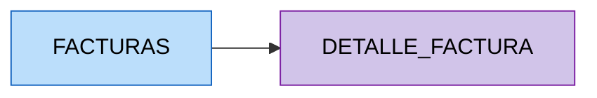
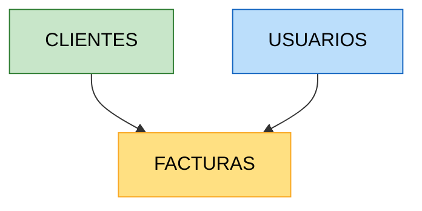
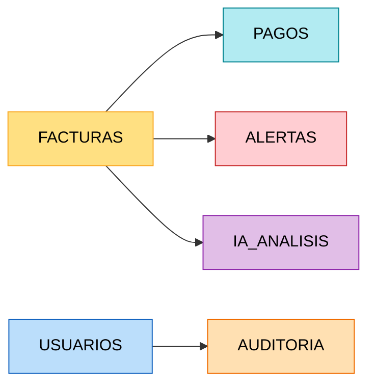
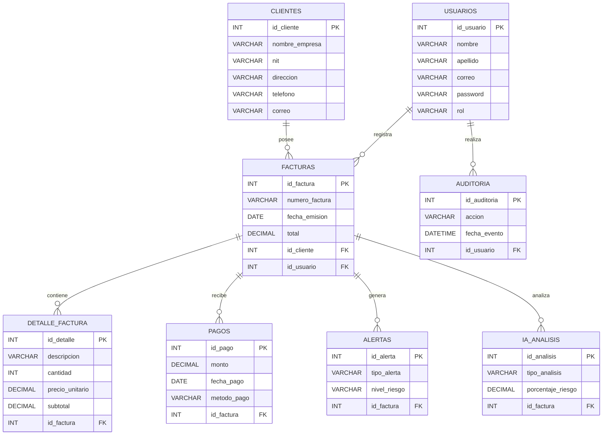

# 🧩 Normalización de Base de Datos hasta Tercera Forma Normal (3FN)

# Sistema Inteligente de Monitoreo de Facturación con IA

---

# 📌 Introducción

La normalización es un proceso utilizado en bases de datos relacionales para organizar la información de manera eficiente, evitando redundancia de datos, inconsistencias y problemas de actualización.

En este proyecto se aplicó el proceso de normalización hasta la **Tercera Forma Normal (3FN)** con el fin de garantizar:

- Integridad de la información.
- Eliminación de redundancia.
- Optimización de consultas.
- Escalabilidad del sistema.
- Mejor rendimiento de la base de datos.

---

# 🔴 Tabla Inicial No Normalizada

Inicialmente, la información del sistema podía encontrarse en una única tabla general:

```text
FACTURACION_GENERAL (
    id_factura,
    numero_factura,
    fecha_emision,
    total_factura,

    nombre_cliente,
    nit_cliente,
    direccion_cliente,
    telefono_cliente,

    nombre_usuario,
    correo_usuario,
    rol_usuario,

    descripcion_producto,
    cantidad,
    precio_unitario,

    fecha_pago,
    metodo_pago,

    tipo_alerta,
    nivel_riesgo,

    tipo_analisis,
    porcentaje_riesgo
)
```

---

# ⚠️ Problemas Detectados

La tabla anterior presentaba múltiples inconvenientes:

- Redundancia de información.
- Duplicidad de datos.
- Dependencias parciales.
- Dependencias transitivas.
- Dificultad para actualizar información.
- Riesgo de inconsistencias.

---

# ✅ Primera Forma Normal (1FN)

## 📌 Regla Aplicada

La Primera Forma Normal establece que:

- Cada atributo debe contener valores atómicos.
- No deben existir grupos repetitivos.
- Cada registro debe ser único.

---

# 🔹 Resultado 1FN

Se separan los datos repetitivos relacionados con productos y detalles de factura.

```text
FACTURAS (
    id_factura PK,
    numero_factura,
    fecha_emision,
    total,
    id_cliente,
    id_usuario
)

DETALLE_FACTURA (
    id_detalle PK,
    descripcion,
    cantidad,
    precio_unitario,
    subtotal,
    id_factura FK
)
```

---

# 📊 Representación Visual 1FN



---

# ✅ Segunda Forma Normal (2FN)

## 📌 Regla Aplicada

La Segunda Forma Normal establece que:

- La tabla debe estar en 1FN.
- Todos los atributos deben depender completamente de la clave primaria.
- Se eliminan dependencias parciales.

---

# 🔹 Resultado 2FN

Se separan las entidades independientes del sistema.

```text
CLIENTES (
    id_cliente PK,
    nombre_empresa,
    nit,
    direccion,
    telefono,
    correo
)

USUARIOS (
    id_usuario PK,
    nombre,
    apellido,
    correo,
    password,
    rol
)

FACTURAS (
    id_factura PK,
    numero_factura,
    fecha_emision,
    total,
    id_cliente FK,
    id_usuario FK
)
```

---

# 📊 Representación Visual 2FN



---

# ✅ Tercera Forma Normal (3FN)

## 📌 Regla Aplicada

La Tercera Forma Normal establece que:

- La tabla debe estar en 2FN.
- No deben existir dependencias transitivas.
- Los atributos no clave no deben depender de otros atributos no clave.

---

# 🔹 Resultado Final en 3FN

Se crean tablas independientes para pagos, alertas, auditorías y análisis IA.

```text
PAGOS (
    id_pago PK,
    fecha_pago,
    monto,
    metodo_pago,
    estado,
    id_factura FK
)

ALERTAS (
    id_alerta PK,
    tipo_alerta,
    descripcion,
    nivel_riesgo,
    fecha_generacion,
    estado,
    id_factura FK
)

IA_ANALISIS (
    id_analisis PK,
    tipo_analisis,
    porcentaje_riesgo,
    observaciones,
    fecha_analisis,
    id_factura FK
)

AUDITORIA (
    id_auditoria PK,
    accion,
    descripcion,
    fecha_evento,
    id_usuario FK
)
```

---

# 📊 Representación Visual 3FN



---

# 🗄️ Modelo Final Normalizado en 3FN



---

# 🎯 Beneficios de la Normalización

La implementación de la Tercera Forma Normal permite:

- Reducir redundancia de datos.
- Evitar inconsistencias.
- Mejorar el mantenimiento de la base de datos.
- Optimizar consultas SQL.
- Facilitar auditorías y monitoreo.
- Mejorar la integridad referencial.
- Escalar el sistema de manera eficiente.

---

# ✅ Conclusión

El proceso de normalización aplicado al Sistema Inteligente de Monitoreo de Facturación permitió estructurar correctamente la base de datos hasta la Tercera Forma Normal (3FN), garantizando una arquitectura sólida, eficiente y preparada para soportar procesos inteligentes de análisis y monitoreo mediante Inteligencia Artificial.