# 🗄️ Modelo Relacional

# Sistema Inteligente de Monitoreo de Facturación con IA

## 📋 Descripción General

El siguiente modelo relacional representa la estructura de base de datos del sistema de monitoreo inteligente de facturación.  
El diseño fue realizado bajo principios de normalización (3FN), permitiendo integridad, escalabilidad y control eficiente de la información.

---

# 📌 Diagrama Relacional

```mermaid
erDiagram

%% =====================================================
%% TABLA USUARIOS
%% =====================================================

USUARIOS {
    INT id_usuario PK
    VARCHAR nombre
    VARCHAR apellido
    VARCHAR correo
    VARCHAR password
    VARCHAR rol
    VARCHAR estado
    DATETIME fecha_registro
}

%% =====================================================
%% TABLA CLIENTES
%% =====================================================

CLIENTES {
    INT id_cliente PK
    VARCHAR nombre_empresa
    VARCHAR nit
    VARCHAR direccion
    VARCHAR telefono
    VARCHAR correo
    VARCHAR estado
}

%% =====================================================
%% TABLA FACTURAS
%% =====================================================

FACTURAS {
    INT id_factura PK
    VARCHAR numero_factura
    DATE fecha_emision
    DECIMAL total
    VARCHAR estado
    INT id_cliente FK
    INT id_usuario FK
}

%% =====================================================
%% TABLA DETALLE_FACTURA
%% =====================================================

DETALLE_FACTURA {
    INT id_detalle PK
    VARCHAR descripcion
    INT cantidad
    DECIMAL precio_unitario
    DECIMAL subtotal
    INT id_factura FK
}

%% =====================================================
%% TABLA PAGOS
%% =====================================================

PAGOS {
    INT id_pago PK
    DATE fecha_pago
    DECIMAL monto
    VARCHAR metodo_pago
    VARCHAR estado
    INT id_factura FK
}

%% =====================================================
%% TABLA ALERTAS
%% =====================================================

ALERTAS {
    INT id_alerta PK
    VARCHAR tipo_alerta
    TEXT descripcion
    VARCHAR nivel_riesgo
    DATETIME fecha_generacion
    VARCHAR estado
    INT id_factura FK
}

%% =====================================================
%% TABLA AUDITORIA
%% =====================================================

AUDITORIA {
    INT id_auditoria PK
    VARCHAR accion
    TEXT descripcion
    DATETIME fecha_evento
    INT id_usuario FK
}

%% =====================================================
%% TABLA IA_ANALISIS
%% =====================================================

IA_ANALISIS {
    INT id_analisis PK
    VARCHAR tipo_analisis
    DECIMAL porcentaje_riesgo
    TEXT observaciones
    DATETIME fecha_analisis
    INT id_factura FK
}

%% =====================================================
%% RELACIONES
%% =====================================================

CLIENTES ||--o{ FACTURAS : posee
USUARIOS ||--o{ FACTURAS : registra
FACTURAS ||--o{ DETALLE_FACTURA : contiene
FACTURAS ||--o{ PAGOS : recibe
FACTURAS ||--o{ ALERTAS : genera
FACTURAS ||--o{ IA_ANALISIS : analiza
USUARIOS ||--o{ AUDITORIA : realiza
```

---

# 📊 Descripción de las Tablas

## 👨‍💼 USUARIOS

Almacena la información de los usuarios que interactúan con el sistema.

| Campo | Tipo | Descripción |
|---|---|---|
| id_usuario | INT | Identificador único |
| nombre | VARCHAR | Nombre del usuario |
| apellido | VARCHAR | Apellido del usuario |
| correo | VARCHAR | Correo electrónico |
| password | VARCHAR | Contraseña cifrada |
| rol | VARCHAR | Rol del usuario |
| estado | VARCHAR | Estado del usuario |
| fecha_registro | DATETIME | Fecha de creación |

---

## 👥 CLIENTES

Contiene la información de los clientes asociados a las facturas.

| Campo | Tipo |
|---|---|
| id_cliente | INT |
| nombre_empresa | VARCHAR |
| nit | VARCHAR |
| direccion | VARCHAR |
| telefono | VARCHAR |
| correo | VARCHAR |
| estado | VARCHAR |

---

## 🧾 FACTURAS

Registra la información principal de las facturas.

| Campo | Tipo |
|---|---|
| id_factura | INT |
| numero_factura | VARCHAR |
| fecha_emision | DATE |
| total | DECIMAL |
| estado | VARCHAR |
| id_cliente | FK |
| id_usuario | FK |

---

## 📦 DETALLE_FACTURA

Contiene los productos o servicios asociados a cada factura.

| Campo | Tipo |
|---|---|
| id_detalle | INT |
| descripcion | VARCHAR |
| cantidad | INT |
| precio_unitario | DECIMAL |
| subtotal | DECIMAL |
| id_factura | FK |

---

## 💳 PAGOS

Registra los pagos realizados sobre las facturas.

| Campo | Tipo |
|---|---|
| id_pago | INT |
| fecha_pago | DATE |
| monto | DECIMAL |
| metodo_pago | VARCHAR |
| estado | VARCHAR |
| id_factura | FK |

---

## 🚨 ALERTAS

Almacena las anomalías o irregularidades detectadas.

| Campo | Tipo |
|---|---|
| id_alerta | INT |
| tipo_alerta | VARCHAR |
| descripcion | TEXT |
| nivel_riesgo | VARCHAR |
| fecha_generacion | DATETIME |
| estado | VARCHAR |
| id_factura | FK |

---

## 🤖 IA_ANALISIS

Guarda los análisis realizados por el motor de Inteligencia Artificial.

| Campo | Tipo |
|---|---|
| id_analisis | INT |
| tipo_analisis | VARCHAR |
| porcentaje_riesgo | DECIMAL |
| observaciones | TEXT |
| fecha_analisis | DATETIME |
| id_factura | FK |

---

## 📝 AUDITORIA

Registra todas las acciones importantes realizadas dentro del sistema.

| Campo | Tipo |
|---|---|
| id_auditoria | INT |
| accion | VARCHAR |
| descripcion | TEXT |
| fecha_evento | DATETIME |
| id_usuario | FK |

---

# 🔗 Relaciones Principales

| Relación | Tipo |
|---|---|
| Un cliente puede tener muchas facturas | 1:N |
| Un usuario puede registrar muchas facturas | 1:N |
| Una factura puede tener muchos detalles | 1:N |
| Una factura puede tener varios pagos | 1:N |
| Una factura puede generar muchas alertas | 1:N |
| Una factura puede tener varios análisis IA | 1:N |
| Un usuario puede registrar muchas auditorías | 1:N |

---

# 🎯 Objetivo del Modelo Relacional

El modelo relacional permite:

- Organizar eficientemente la información.
- Garantizar integridad referencial.
- Facilitar auditorías y monitoreo.
- Optimizar consultas y reportes.
- Escalar el sistema de manera segura.
- Integrar procesos inteligentes de análisis mediante IA.