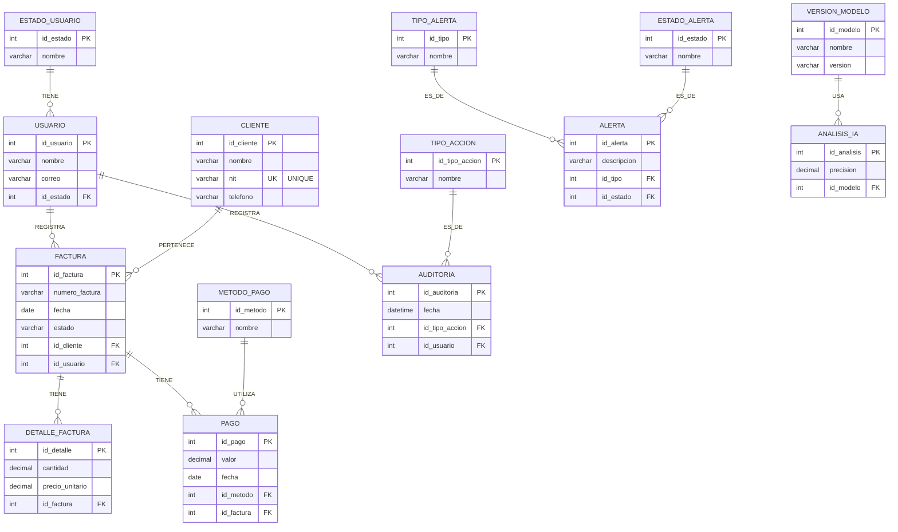

# Modelo Entidad Relación (MER)
## Sistema de Monitoreo Inteligente de Facturación con IA

---

# ¿Qué es un Modelo Entidad Relación?

El Modelo Entidad Relación (MER) es una representación conceptual de la base de datos que permite identificar las entidades principales del sistema, sus atributos y las relaciones existentes entre ellas.

Este modelo sirve como base para el diseño del modelo relacional y posteriormente para la implementación física de la base de datos en MySQL/MariaDB.

---

# Diagrama MER (Corregido)

A continuación se presenta el Modelo Entidad Relación utilizando la sintaxis de Mermaid para una visualización clara y estructurada de las entidades, atributos, claves primarias (PK), claves foráneas (FK) y sus cardinalidades.

---

## Reglas de Negocio Importantes

Basado en el diseño corregido, se deben tener en cuenta las siguientes lógicas para la aplicación:

1. **El campo total de FACTURA fue eliminado**: Se calcula sumando los subtotales de la tabla `DETALLE_FACTURA`.
2. **Cálculo del subtotal**: El subtotal de cada ítem se calcula como `cantidad * precio_unitario` directamente en la aplicación, no se almacena en la base de datos.
3. **Cambio de estado de la factura**: El estado de la factura puede cambiar automáticamente cuando se registra un pago (por ejemplo: pasar de "Pendiente" a "Pagada") o puede manejarse manualmente según la lógica del sistema.
4. **Restricción de Cliente**: El campo `nit` en la tabla `CLIENTE` tiene restricción `UNIQUE` (no pueden existir dos clientes con el mismo NIT).