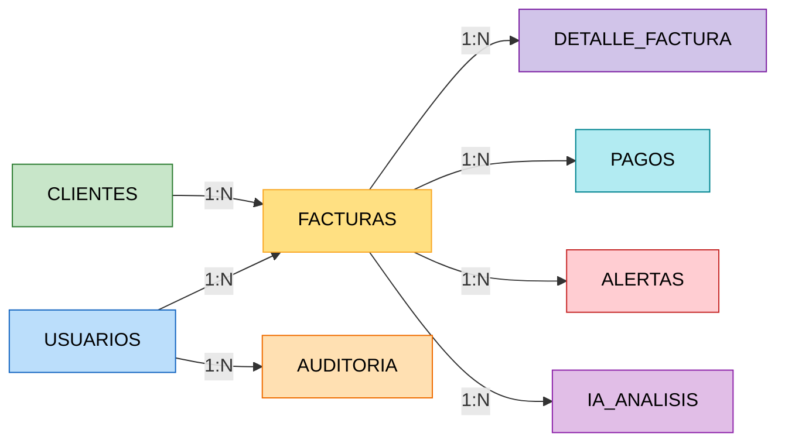

# 🗄️ Modelo Relacional  
# Sistema Inteligente de Monitoreo de Facturación con IA

---

# 📌 Esquema Relacional

```text
USUARIOS (
    id_usuario PK,
    nombre,
    apellido,
    correo UNIQUE,
    password,
    rol,
    estado,
    fecha_registro
)

CLIENTES (
    id_cliente PK,
    nombre_empresa,
    nit UNIQUE,
    direccion,
    telefono,
    correo,
    estado
)

FACTURAS (
    id_factura PK,
    numero_factura UNIQUE,
    fecha_emision,
    total,
    estado,
    id_cliente FK,
    id_usuario FK
)

DETALLE_FACTURA (
    id_detalle PK,
    descripcion,
    cantidad,
    precio_unitario,
    subtotal,
    id_factura FK
)

PAGOS (
    id_pago PK,
    fecha_pago,
    monto,
    metodo_pago,
    estado,
    id_factura FK
)

ALERTAS (
    id_alerta PK,
    tipo_alerta,
    descripcion,
    nivel_riesgo,
    fecha_generacion,
    estado,
    id_factura FK
)

IA_ANALISIS (
    id_analisis PK,
    tipo_analisis,
    porcentaje_riesgo,
    observaciones,
    fecha_analisis,
    id_factura FK
)

AUDITORIA (
    id_auditoria PK,
    accion,
    descripcion,
    fecha_evento,
    id_usuario FK
)
```

---

# 🔗 Relaciones del Modelo



---

# 📊 Cardinalidades

| Tabla Principal | Relación | Tabla Relacionada |
|---|---|---|
| CLIENTES | 1:N | FACTURAS |
| USUARIOS | 1:N | FACTURAS |
| FACTURAS | 1:N | DETALLE_FACTURA |
| FACTURAS | 1:N | PAGOS |
| FACTURAS | 1:N | ALERTAS |
| FACTURAS | 1:N | IA_ANALISIS |
| USUARIOS | 1:N | AUDITORIA |

---

# 🎯 Objetivo del Modelo Relacional

El modelo relacional permite estructurar la información del sistema de manera organizada y normalizada, garantizando:

- Integridad referencial.
- Seguridad de los datos.
- Escalabilidad del sistema.
- Control eficiente de facturación.
- Monitoreo inteligente mediante IA.
- Generación de reportes y auditorías.
- Detección automática de anomalías.