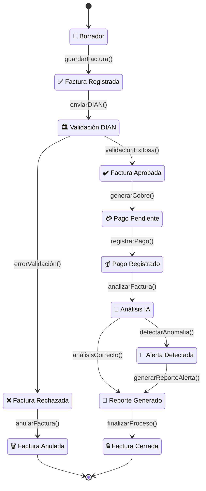

# 📘 E14 - Diagrama de Estados

# Sistema Inteligente de Monitoreo de Facturación con IA

---

# 📌 Descripción

El diagrama de estados representa el ciclo de vida de una factura electrónica dentro del sistema inteligente de monitoreo de facturación con IA.

Este modelo permite visualizar las transiciones de estado que atraviesa una factura desde su creación hasta su cierre o anulación, incluyendo validaciones automáticas, análisis inteligentes y generación de alertas.

---

# 🔄 Diagrama de Estados — Factura Electrónica

---

# 📋 Descripción de Estados

| Estado | Descripción |
|---|---|
| 📝 Borrador | La factura se encuentra en proceso de creación |
| ✅ Factura Registrada | La factura fue almacenada en la base de datos |
| 🏛️ Validación DIAN | La factura es validada electrónicamente |
| ✔️ Factura Aprobada | La DIAN aprueba la factura |
| 💳 Pago Pendiente | La factura está pendiente de pago |
| 💰 Pago Registrado | El pago fue registrado correctamente |
| 🤖 Análisis IA | El sistema analiza la factura mediante IA |
| 🚨 Alerta Detectada | Se detectó una anomalía o riesgo |
| 📑 Reporte Generado | El sistema genera reporte automático |
| ❌ Factura Rechazada | La factura presenta errores |
| 🗑️ Factura Anulada | La factura fue cancelada |
| 🔒 Factura Cerrada | El proceso finalizó correctamente |

---

# ⚙️ Reglas de Transición

| Evento | Acción |
|---|---|
| guardarFactura() | Registra la factura |
| enviarDIAN() | Envía factura a validación |
| validaciónExitosa() | Aprueba factura |
| errorValidación() | Rechaza factura |
| registrarPago() | Registra pago |
| analizarFactura() | Ejecuta análisis IA |
| detectarAnomalia() | Genera alerta automática |
| generarReporteAlerta() | Genera reporte de riesgo |
| finalizarProceso() | Cierra proceso de facturación |

---

# 🎯 Objetivo del Diagrama

El diagrama de estados permite:

- Representar el comportamiento dinámico de una factura.
- Controlar el flujo de validación electrónica.
- Gestionar pagos y cierres.
- Integrar procesos inteligentes mediante IA.
- Detectar anomalías automáticamente.
- Facilitar auditoría y monitoreo del sistema.

---

# 🧠 Relación con el Framework

## Lo que genera en el sistema

- Campos de estado en la base de datos.
- Lógica de transición entre procesos.
- Validaciones automáticas.
- Control de flujo del ciclo de facturación.
- Reglas de negocio asociadas al estado.
- Integración con IA y alertas automáticas.