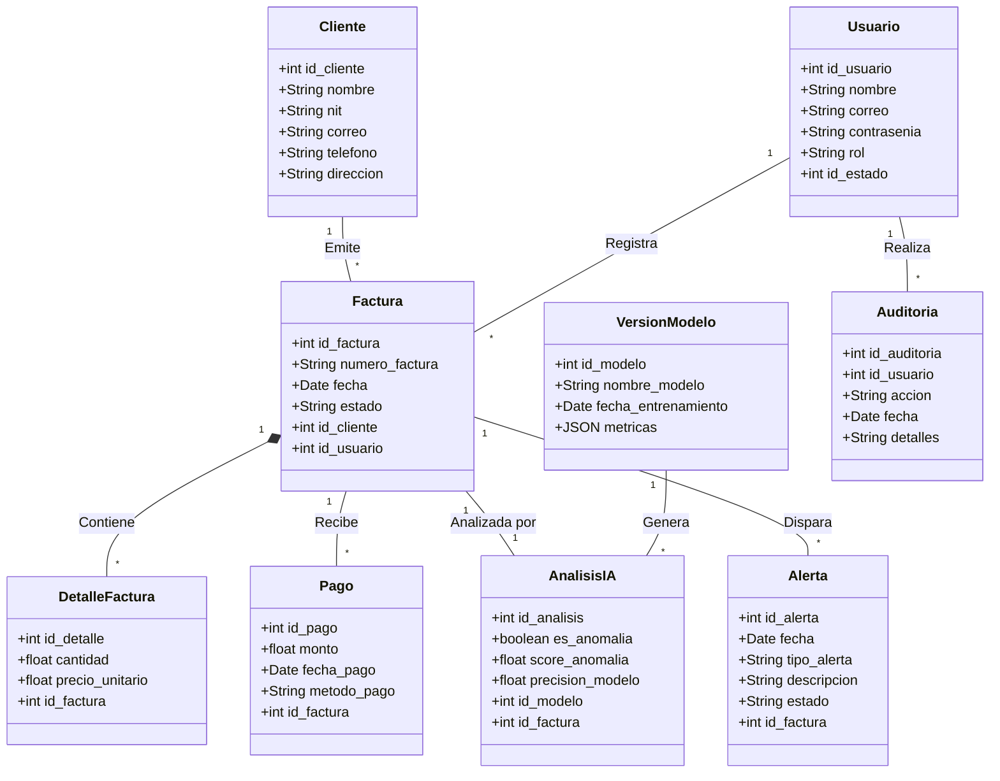

# 📘 E12 - Diagrama de Clases

# Sistema Inteligente de Monitoreo de Facturación con IA

---

# 📌 Descripción

El diagrama de clases representa la estructura estática de la base de datos y la capa de modelos (ORM) del sistema de facturación.
Muestra las entidades, sus atributos y las relaciones (Llaves Foráneas) entre maestras (Cliente, Usuario) y transaccionales (Factura, Pago, AnalisisIA, etc.).

---

# 📊 Diagrama de Clases

---

# 📋 Relaciones Principales (Llaves Foráneas)

- **Factura -> Cliente:** Relación 1 a muchos. Un cliente puede tener muchas facturas. (`id_cliente` en Factura).
- **Factura -> Usuario:** Relación 1 a muchos. Un usuario (contador) registra muchas facturas. (`id_usuario` en Factura).
- **DetalleFactura -> Factura:** Relación de composición 1 a muchos. Una factura tiene varios items (detalles).
- **AnalisisIA -> Factura:** Relación 1 a 1. Cada factura se evalúa en el motor de Isolation Forest.
- **Auditoria -> Usuario:** Cada registro en la bitácora de auditoría apunta al usuario que ejecutó la acción.