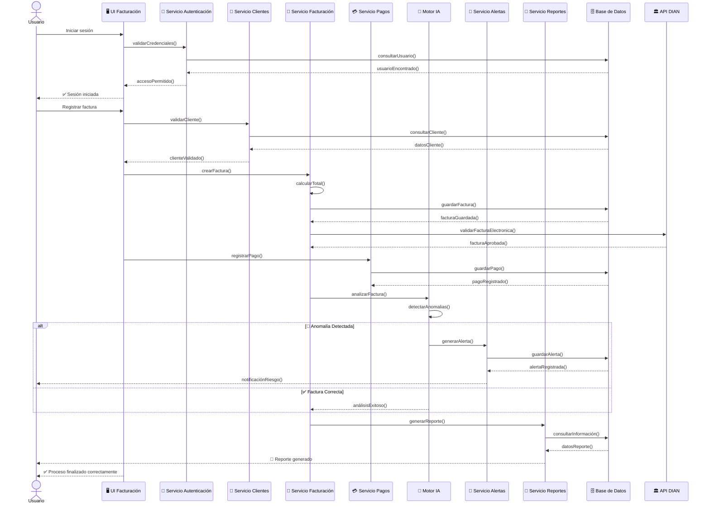

# 📘 E13 - Diagrama de Secuencia

# Sistema Inteligente de Monitoreo de Facturación con IA

---

# 📌 Descripción

El diagrama de secuencia representa el flujo de interacción entre usuarios, interfaces, clases, servicios y sistemas externos durante el proceso de registro, validación y monitoreo de una factura electrónica.

Este diagrama permite visualizar el orden cronológico de ejecución de métodos, validaciones y respuestas del sistema.

---

# 🔄 Diagrama de Secuencia — Registro y Monitoreo de Factura

---

# 📋 Flujo del Proceso

| Paso | Acción |
|---|---|
| 1 | Usuario inicia sesión |
| 2 | Sistema valida credenciales |
| 3 | Usuario registra factura |
| 4 | Sistema valida cliente |
| 5 | Factura es almacenada |
| 6 | Factura es enviada a la DIAN |
| 7 | Se registra el pago |
| 8 | Motor IA analiza la factura |
| 9 | Sistema detecta anomalías |
| 10 | Se generan alertas automáticas |
| 11 | Se genera reporte |
| 12 | Finaliza el proceso |

---

# 🧩 Clases y Servicios Relacionados

| Clase / Servicio | Responsabilidad |
|---|---|
| Servicio Autenticación | Validar usuarios |
| Servicio Clientes | Gestionar clientes |
| Servicio Facturación | Registrar facturas |
| Servicio Pagos | Gestionar pagos |
| Motor IA | Analizar comportamiento financiero |
| Servicio Alertas | Generar alertas automáticas |
| Servicio Reportes | Generar reportes |
| API DIAN | Validar factura electrónica |

---

# ⚙️ Métodos Utilizados

| Método | Función |
|---|---|
| validarCredenciales() | Autenticar usuario |
| validarCliente() | Verificar cliente |
| crearFactura() | Registrar factura |
| calcularTotal() | Calcular total facturado |
| registrarPago() | Registrar pago |
| analizarFactura() | Ejecutar análisis IA |
| detectarAnomalias() | Detectar riesgos |
| generarAlerta() | Crear alertas |
| generarReporte() | Generar reporte PDF |

---

# 🎯 Objetivo del Diagrama

El diagrama de secuencia permite:

- Visualizar el flujo cronológico del sistema.
- Representar interacción entre módulos.
- Mostrar llamadas a métodos y respuestas.
- Comprender la lógica del proceso de facturación.
- Integrar validaciones automáticas e IA.
- Facilitar análisis y desarrollo del software.

---

# 🧠 Relación con el Framework

## Lo que genera en el sistema

- Métodos de controladores.
- Métodos de servicios.
- Lógica de negocio.
- Integraciones API.
- Validaciones automáticas.
- Flujo interno de ejecución.