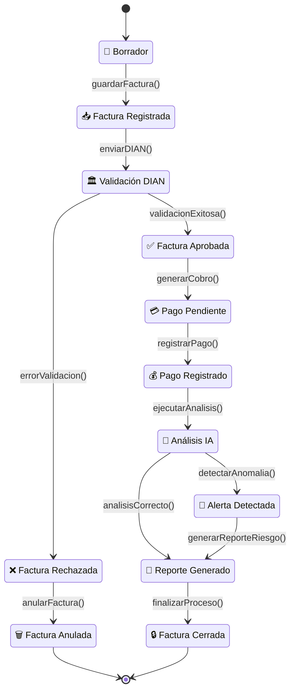

# 📘 E14 - Diagrama de Estados

# Sistema Inteligente de Monitoreo de Facturación con IA

---

# 📌 Descripción

El diagrama de estados representa el comportamiento dinámico de una factura electrónica dentro del sistema inteligente de monitoreo de facturación con IA.

Este modelo muestra los diferentes estados por los que pasa una factura durante su ciclo de vida, desde su creación hasta su cierre, incluyendo validaciones, pagos, análisis inteligentes y generación de alertas automáticas.

---

# 🔄 Diagrama de Estados — Ciclo de Vida de la Factura

---

# 📋 Descripción de Estados

| Estado | Descripción |
|---|---|
| 📝 Borrador | La factura está siendo creada |
| 📥 Factura Registrada | La factura fue almacenada |
| 🏛️ Validación DIAN | La factura es enviada a validación electrónica |
| ✅ Factura Aprobada | La DIAN aprueba la factura |
| ❌ Factura Rechazada | La DIAN rechaza la factura |
| 💳 Pago Pendiente | La factura espera pago |
| 💰 Pago Registrado | El pago fue registrado |
| 🤖 Análisis IA | La IA analiza comportamiento y riesgos |
| 🚨 Alerta Detectada | Se detectó anomalía financiera |
| 📑 Reporte Generado | El sistema genera reporte |
| 🔒 Factura Cerrada | El proceso finaliza correctamente |
| 🗑️ Factura Anulada | La factura es anulada |

---

# ⚙️ Eventos de Transición

| Evento | Acción |
|---|---|
| guardarFactura() | Registra factura |
| enviarDIAN() | Envía factura electrónica |
| validacionExitosa() | Aprueba factura |
| errorValidacion() | Rechaza factura |
| registrarPago() | Registra pago |
| ejecutarAnalisis() | Ejecuta IA |
| detectarAnomalia() | Genera alerta automática |
| generarReporteRiesgo() | Genera reporte de riesgo |
| finalizarProceso() | Finaliza proceso |

---

# 🧩 Relación con Clases del Sistema

| Clase | Participación |
|---|---|
| Factura | Gestiona estados de facturación |
| Pago | Controla pagos |
| AnalisisIA | Ejecuta análisis inteligentes |
| Alerta | Genera alertas |
| Reporte | Genera reportes |
| Auditoria | Registra eventos del proceso |

---

# 📊 Flujo General

```mermaid
flowchart LR

BORRADOR["📝 Borrador"]
REG["📥 Registrada"]
DIAN["🏛️ Validación DIAN"]
APROB["✅ Aprobada"]
PAGO["💳 Pago"]
IA["🤖 IA"]
ALERTA["🚨 Alerta"]
REP["📑 Reporte"]
FIN["🔒 Cerrada"]

BORRADOR --> REG
REG --> DIAN
DIAN --> APROB
APROB --> PAGO
PAGO --> IA
IA --> ALERTA
IA --> REP
ALERTA --> REP
REP --> FIN

%% ===================================================
%% ESTILOS
%% ===================================================

style BORRADOR fill:#E1F5FE,stroke:#0288D1,color:#000000
style REG fill:#C8E6C9,stroke:#2E7D32,color:#000000
style DIAN fill:#B3E5FC,stroke:#0288D1,color:#000000
style APROB fill:#DCEDC8,stroke:#558B2F,color:#000000
style PAGO fill:#FFF59D,stroke:#F9A825,color:#000000
style IA fill:#E1BEE7,stroke:#8E24AA,color:#000000
style ALERTA fill:#FFCDD2,stroke:#C62828,color:#000000
style REP fill:#FFE0B2,stroke:#EF6C00,color:#000000
style FIN fill:#CFD8DC,stroke:#455A64,color:#000000
```

---

# 🎯 Objetivo del Diagrama

El diagrama de estados permite:

- Controlar el ciclo de vida de la factura.
- Representar validaciones electrónicas.
- Gestionar pagos y análisis inteligentes.
- Detectar anomalías automáticamente.
- Integrar generación de alertas.
- Facilitar auditoría y monitoreo del sistema.

---

# 🧠 Relación con el Framework

## Lo que genera en el sistema

- Campos de estado en base de datos.
- Reglas de transición.
- Validaciones automáticas.
- Lógica de negocio.
- Control del flujo de procesos.
- Integración con IA y alertas automáticas.