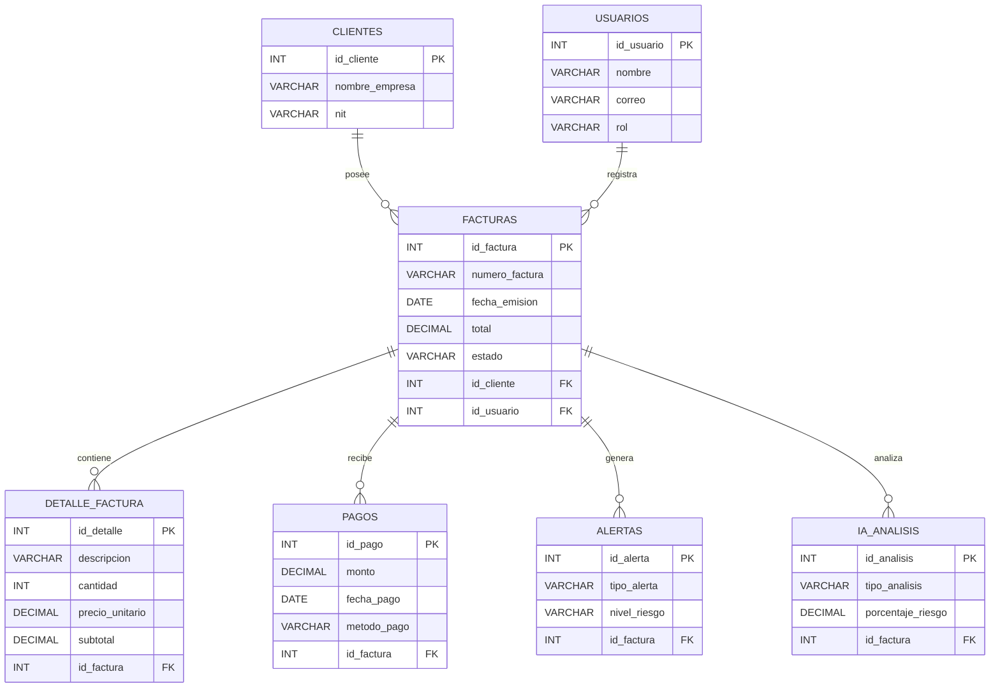
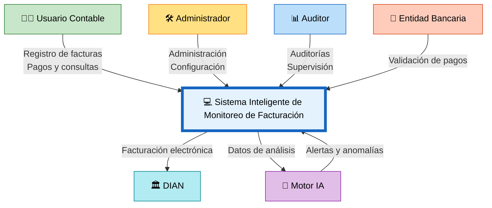

# 📘 M1 - Entidades - RF - CU - DCA

# Sistema Inteligente de Monitoreo de Facturación con IA

---

# 📌 M1 — Módulo de Gestión de Facturación Inteligente

El módulo M1 corresponde al núcleo principal del sistema, encargado del registro, monitoreo y análisis inteligente de las facturas dentro de la plataforma.

Este módulo permite automatizar procesos contables, detectar anomalías y generar alertas mediante técnicas de Inteligencia Artificial.

---

# 🗂️ Entidades Relacionadas

## 📊 Diagrama de Entidades

---

# 📋 RF — Requerimientos Funcionales

| Código | Requerimiento Funcional |
|---|---|
| RF-01 | El sistema debe permitir registrar facturas electrónicas. |
| RF-02 | El sistema debe gestionar clientes asociados a las facturas. |
| RF-03 | El sistema debe registrar pagos relacionados con cada factura. |
| RF-04 | El sistema debe analizar automáticamente las facturas mediante IA. |
| RF-05 | El sistema debe detectar anomalías en tiempo real. |
| RF-06 | El sistema debe generar alertas automáticas ante irregularidades. |
| RF-07 | El sistema debe permitir consultar reportes financieros. |
| RF-08 | El sistema debe validar facturas electrónicas con la DIAN. |
| RF-09 | El sistema debe registrar auditorías de acciones realizadas. |
| RF-10 | El sistema debe permitir gestionar usuarios y roles. |

---

# 👥 CU — Casos de Uso

## 📊 Diagrama de Casos de Uso

---

# 🌐 DCA — Diagrama de Contexto

## 📊 Contexto General del Sistema

---

# 🎯 Objetivo del Módulo M1

El módulo M1 tiene como objetivo centralizar y optimizar el proceso de facturación inteligente mediante:

- Registro automatizado de facturas.
- Monitoreo financiero en tiempo real.
- Detección automática de anomalías.
- Generación de alertas inteligentes.
- Integración con procesos de auditoría.
- Validación de facturación electrónica.
- Mejora del control contable y financiero.