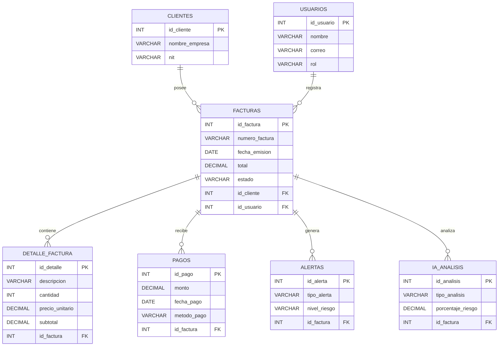
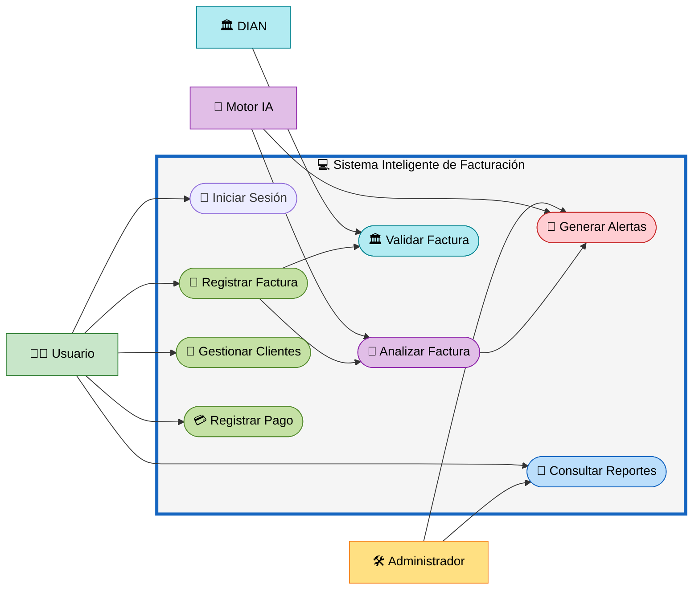
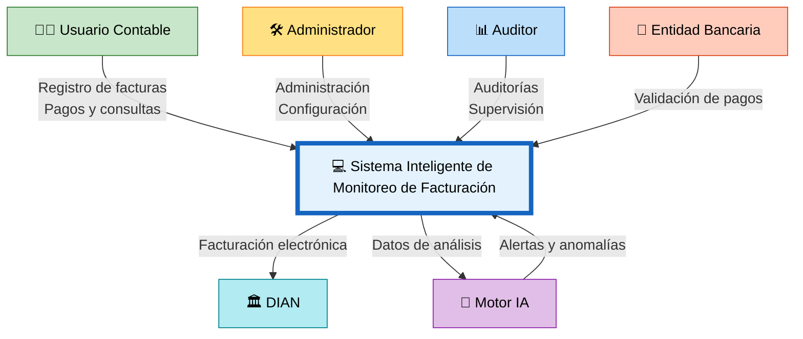

# 📘 M1 - Entidades - RF - CU - DCA

# Sistema Inteligente de Monitoreo de Facturación con IA

---

# 📌 M1 — Módulo de Gestión de Facturación Inteligente

El módulo M1 corresponde al núcleo principal del sistema, encargado del registro, monitoreo y análisis inteligente de las facturas dentro de la plataforma.

Este módulo permite automatizar procesos contables, detectar anomalías y generar alertas mediante técnicas de Inteligencia Artificial.

---

# 🗂️ Entidades Relacionadas

## 📊 Diagrama de Entidades

---

# 📋 RF — Requerimientos Funcionales

| ID | Nombre | Descripción detallada | Actor(es) | Prioridad | ID Requisito de Usuario (RU) | Precondición | Postcondición |
|---|---|---|---|---|---|---|---|
| RF-001 | Crear Clientes | El sistema debe permitir el registro de un nuevo cliente capturando sus datos fiscales y de contacto (NIT, Razón Social, Dirección, Teléfono, Correo). | Analista, Administrador | Alta | RU-01 | El usuario debe estar autenticado y tener permisos de creación. | El cliente queda almacenado en la base de datos con estado activo. |
| RF-002 | Modificar Clientes | El sistema debe permitir actualizar la información fiscal y de contacto de un cliente existente, manteniendo un registro histórico de los cambios. | Analista, Administrador | Alta | RU-02 | El cliente debe existir en la base de datos. | La información del cliente se actualiza y queda disponible para nuevas transacciones. |
| RF-003 | Inhabilitar Clientes | El sistema debe permitir cambiar el estado de un cliente a "Inactivo" para restringir la generación de nuevas facturas, sin eliminar su historial. | Administrador | Media | RU-03 | El cliente debe existir y tener un estado activo. | El cliente pasa a estado inactivo y el sistema bloquea nueva facturación a su nombre. |
| RF-004 | Consultar Clientes | El sistema debe proporcionar un motor de búsqueda con filtros (NIT, nombre, estado) para visualizar la información de los clientes registrados. | Administrador, Analista, Contador, Usuario del Sistema | Alta | RU-04 | El usuario debe tener una sesión activa. | El sistema retorna una lista de clientes que coinciden con los criterios de búsqueda. |
| RF-005 | Auditar Cambios de Clientes | El sistema debe registrar automáticamente la fecha, hora, usuario y datos modificados cada vez que se ejecute una acción sobre la información de un cliente. | Sistema | Baja | RU-05 | Se debe ejecutar una acción de creación, modificación o inhabilitación. | Queda un registro de auditoría inmutable en la base de datos. |
| RF-006 | Generar Facturas | El sistema debe permitir el registro y emisión de facturas, asociándolas a un cliente válido y calculando automáticamente subtotales e impuestos. | Analista, Contador | Alta | RU-06 | El cliente asociado debe estar en estado activo. | La factura se genera, almacena y queda encolada para el proceso de monitoreo. |
| RF-007 | Monitoreo en Tiempo Real | El sistema debe evaluar continuamente el flujo de facturación entrante, procesando cada transacción en el mismo instante de su registro. | Sistema | Alta | RU-07 | Deben registrarse nuevas facturas en el sistema. | Las facturas procesadas quedan marcadas como "Analizadas". |
| RF-008 | Detección de Anomalías | El sistema debe aplicar modelos de Inteligencia Artificial para identificar patrones inusuales, duplicidades, montos atípicos o inconsistencias contables en las facturas. | Motor de IA | Alta | RU-08 | La factura debe estar en proceso de monitoreo. | El sistema asigna un nivel de riesgo y un porcentaje de probabilidad de anomalía a la factura. |
| RF-009 | Visualización de Reportes | El sistema debe proveer un panel de control interactivo (Dashboard) que muestre estadísticas, métricas financieras y resúmenes gráficos de las anomalías detectadas. | Administrador, Contador | Media | RU-09 | El usuario debe tener permisos de lectura de reportes. | Se despliegan en pantalla gráficos e indicadores consolidados de la información. |
| RF-010 | Notificaciones de Anomalías | El sistema debe enviar alertas automatizadas (vía correo electrónico o notificaciones in-app) a los roles designados cuando se detecte una factura con riesgo alto. | Sistema | Alta | RU-10 | El Motor de IA debe clasificar una factura con nivel de riesgo "Alto". | La alerta es generada y enviada a los destinatarios previamente configurados. |
| RF-011 | Configuración de Umbrales | El sistema debe permitir definir, modificar y ajustar los parámetros, límites de montos y reglas de negocio estrictas para la detección de anomalías. | Administrador | Media | RU-11 | El usuario debe tener permisos avanzados de configuración. | Los nuevos umbrales se aplican a los análisis futuros ejecutados por la IA. |
| RF-012 | Control de Acceso Seguro | El sistema debe validar las credenciales de ingreso mediante encriptación y bloquear el acceso a la cuenta tras múltiples intentos fallidos consecutivos. | Sistema | Alta | RU-12 | Un usuario debe intentar acceder introduciendo sus credenciales. | Se concede el acceso generando un token de sesión, o se deniega mostrando un error. |
| RF-013 | Almacenamiento Histórico | El sistema debe archivar de forma segura y persistente todas las facturas, resultados de análisis y alertas generadas por un período legal mínimo requerido. | Sistema | Media | RU-13 | La transacción o análisis debe haber finalizado. | La información queda respaldada y disponible para futuras auditorías o consultas. |
| RF-014 | Gestión de Roles y Permisos | El sistema debe permitir la asignación de permisos granulares (lectura, escritura, eliminación) a los diferentes roles de usuario para restringir el acceso a los módulos. | Administrador | Alta | RU-14 | El administrador debe acceder al panel de seguridad. | Los privilegios del usuario son actualizados y aplicados en la plataforma. |
| RF-015 | Integración con la DIAN | El sistema debe comunicarse mediante API para cruzar datos y validar el estado fiscal y la validez técnica de las facturas electrónicas registradas. | Sistema | Alta | RU-15 | La factura debe estar registrada en el sistema. | El estado de validación ante la entidad gubernamental queda registrado en el sistema. |
| RF-016 | Carga Masiva de Facturas | El sistema debe permitir la importación de facturas en lote mediante archivos estructurados (XML, CSV) para su posterior evaluación simultánea. | Contador, Analista | Media | RU-16 | El archivo cargado debe cumplir con la estructura y formato requeridos. | Las facturas son insertadas masivamente y enviadas a la cola de análisis de IA. |
| RF-017 | Exportación de Reportes | El sistema debe permitir la exportación y descarga de la información consolidada, facturas y alertas en formatos estándar (PDF, Excel). | Administrador, Contador, Analista | Media | RU-17 | El reporte o tabla de datos debe estar generado en pantalla. | El usuario descarga un archivo con la información procesada. |
| RF-018 | Retroalimentación de la IA | El sistema debe permitir a un usuario experto confirmar o descartar una anomalía detectada, utilizando esta decisión como dato de reentrenamiento para el modelo de IA. | Contador, Administrador | Alta | RU-18 | Debe existir una alerta de anomalía generada previamente por el sistema. | El modelo de IA registra la validación humana (Falso Positivo/Verdadero Positivo) para ajustar su precisión. |

---

# 👥 CU — Casos de Uso

## 📊 Diagrama de Casos de Uso

---

# 🌐 DCA — Diagrama de Contexto

## 📊 Contexto General del Sistema

---

# 🎯 Objetivo del Módulo M1

El módulo M1 tiene como objetivo centralizar y optimizar el proceso de facturación inteligente mediante:

- Registro automatizado de facturas.
- Monitoreo financiero en tiempo real.
- Detección automática de anomalías.
- Generación de alertas inteligentes.
- Integración con procesos de auditoría.
- Validación de facturación electrónica.
- Mejora del control contable y financiero.