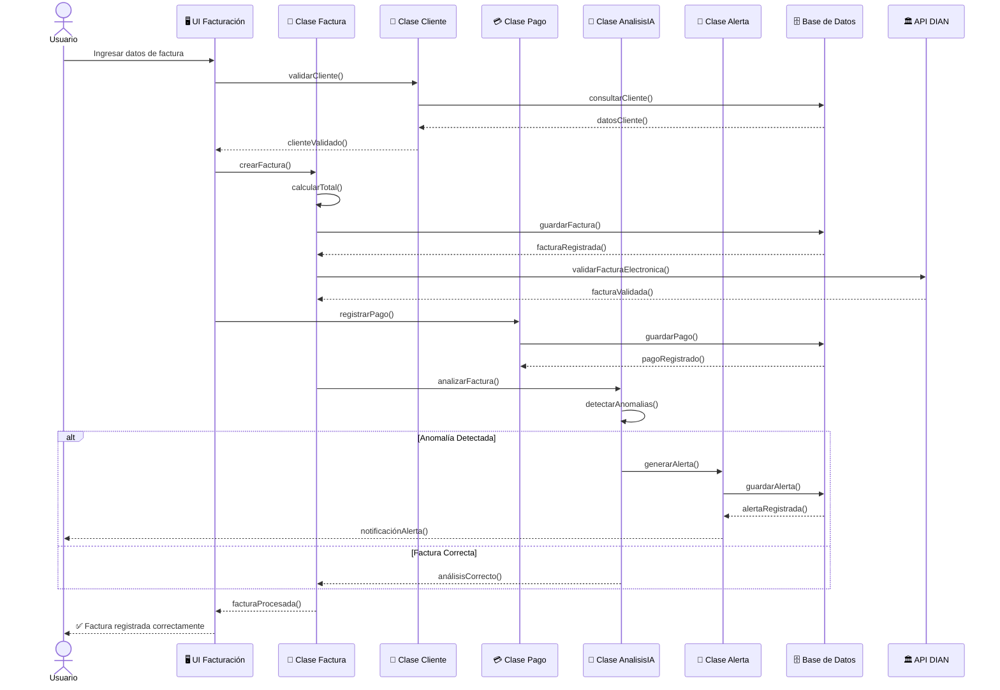
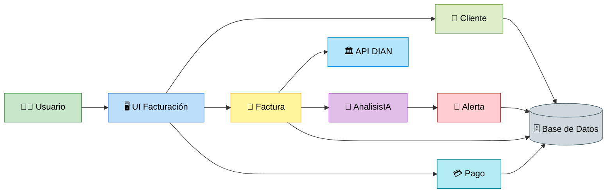

# 📘 M10 - Secuencia - CU - Clases

# Sistema Inteligente de Monitoreo de Facturación con IA

---

# 📌 M10 — Diagramas de Secuencia y Relación con Clases

El módulo M10 representa el flujo secuencial de interacción entre los actores, interfaces, clases y procesos internos del sistema durante la ejecución de las funcionalidades principales.

Este módulo permite visualizar cómo se comunican los componentes del software en tiempo real, mostrando el orden de ejecución de métodos y operaciones.

---

# 🔄 Diagrama de Secuencia Principal

## 📊 Flujo de Registro y Análisis de Facturación

---

# 👥 CU — Casos de Uso Relacionados

| Código | Caso de Uso |
|---|---|
| CU01 | Iniciar sesión |
| CU02 | Registrar factura |
| CU03 | Gestionar clientes |
| CU04 | Registrar pagos |
| CU05 | Analizar facturación |
| CU06 | Detectar anomalías |
| CU07 | Generar alertas |
| CU08 | Consultar reportes |
| CU09 | Validar factura electrónica |

---

# 🧩 Clases Participantes

| Clase | Responsabilidad |
|---|---|
| Factura | Gestionar información de facturación |
| Cliente | Validar y administrar clientes |
| Pago | Registrar pagos |
| AnalisisIA | Analizar datos y detectar anomalías |
| Alerta | Gestionar alertas automáticas |
| Usuario | Interactuar con el sistema |
| Reporte | Generar reportes financieros |

---

# 🏛️ Relación entre Clases y Flujo

## 📊 Diagrama Simplificado de Interacción

---

# 📋 Flujo General del Proceso

| Paso | Acción |
|---|---|
| 1 | Usuario registra factura |
| 2 | Sistema valida cliente |
| 3 | Factura es almacenada |
| 4 | Se valida electrónicamente con la DIAN |
| 5 | Se registra el pago |
| 6 | Motor IA analiza la factura |
| 7 | Se detectan posibles anomalías |
| 8 | Sistema genera alertas automáticas |
| 9 | Información queda almacenada |

---

# 🎯 Objetivo del Módulo M10

El módulo M10 tiene como objetivo:

- Representar el flujo dinámico del sistema.
- Mostrar la interacción entre clases.
- Definir el orden de ejecución de procesos.
- Visualizar llamadas a métodos y respuestas.
- Facilitar el análisis del comportamiento del software.
- Mejorar la comprensión de la lógica interna del sistema.