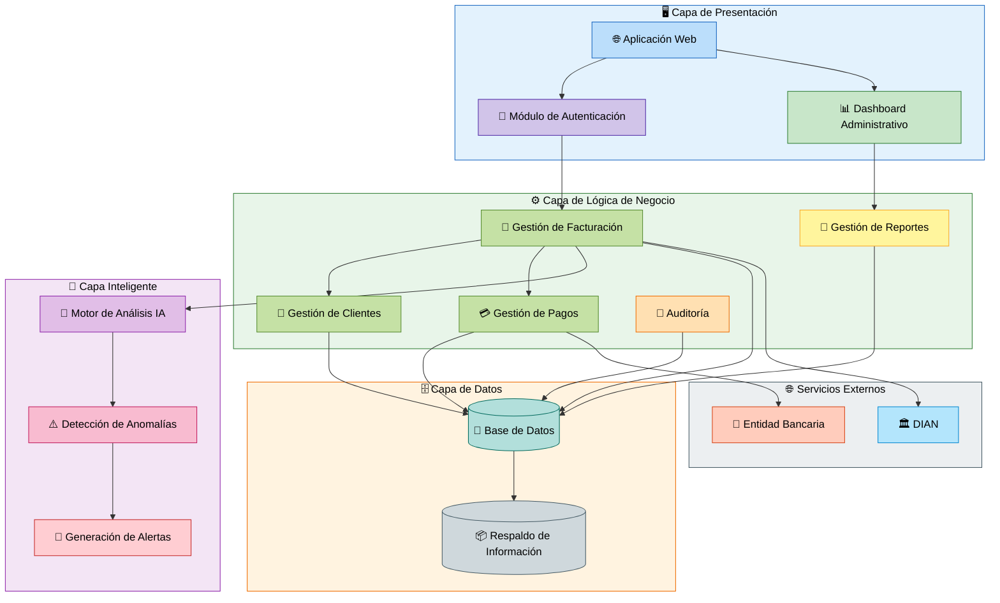
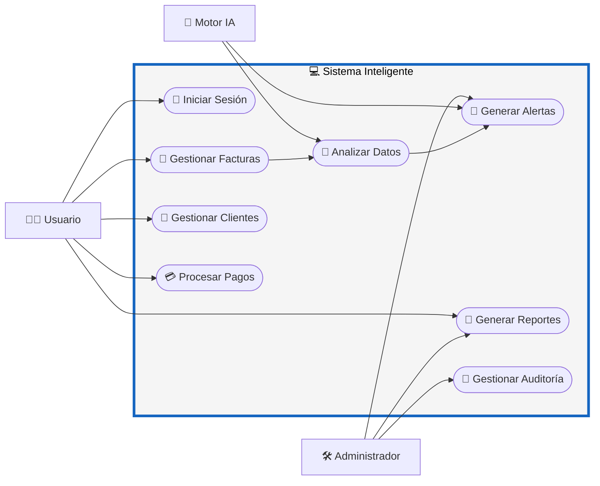

# 📘 M2 - Arquetipos - CU - RF

# Sistema Inteligente de Monitoreo de Facturación con IA

---

# 📌 M2 — Módulo de Arquitectura y Gestión Inteligente

El módulo M2 representa la estructura arquitectónica y funcional del sistema, definiendo los componentes principales, la interacción entre módulos y los procesos inteligentes encargados del monitoreo y análisis de facturación.

Este módulo permite organizar el funcionamiento interno del software mediante una arquitectura modular, escalable y orientada a servicios.

---

# 🏛️ Arquetipos del Sistema

## 📊 Diagrama de Arquetipos

---

# 👥 CU — Casos de Uso del Módulo

## 📊 Diagrama de Casos de Uso

---

# 📋 RF — Requerimientos Funcionales

| Código | Requerimiento Funcional |
|---|---|
| RF-11 | El sistema debe contar con autenticación segura de usuarios. |
| RF-12 | El sistema debe permitir la gestión de clientes. |
| RF-13 | El sistema debe permitir registrar y monitorear facturas. |
| RF-14 | El sistema debe procesar pagos relacionados con facturas. |
| RF-15 | El sistema debe analizar automáticamente los datos mediante IA. |
| RF-16 | El sistema debe detectar anomalías financieras automáticamente. |
| RF-17 | El sistema debe generar alertas automáticas en tiempo real. |
| RF-18 | El sistema debe generar reportes administrativos y financieros. |
| RF-19 | El sistema debe registrar auditorías de las acciones realizadas. |
| RF-20 | El sistema debe mantener respaldos seguros de la información. |

---

# 🎯 Objetivo del Módulo M2

El módulo M2 tiene como objetivo definir la arquitectura y organización funcional del sistema, permitiendo:

- Separación modular de responsabilidades.
- Escalabilidad del software.
- Integración con Inteligencia Artificial.
- Seguridad y control de la información.
- Gestión eficiente de procesos contables.
- Monitoreo inteligente de facturación.
- Optimización del flujo de datos y servicios.