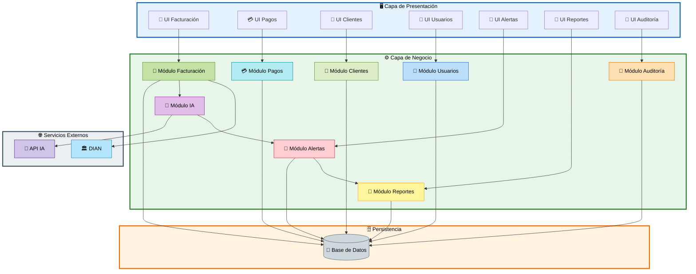

# 📘 M3 - Componentes - Arquetipos - RF

# Sistema Inteligente de Monitoreo de Facturación con IA

---

# 📌 M3 — Componentes del Sistema

El módulo M3 representa la estructura de componentes principales del sistema, mostrando la relación entre los módulos funcionales, sus arquetipos asociados, los requerimientos funcionales y las interfaces que interactúan dentro de la plataforma.

Este modelo permite visualizar la organización lógica del software y cómo cada componente participa en el proceso inteligente de monitoreo de facturación.

---

# 🧩 Tabla de Componentes y Arquetipos

| Componente/Módulo | Arquetipo Principal | RF Asociados | Interfaz |
|---|---|---|---|
| 🧾 Módulo Facturación | Factura, DetalleFactura | RF01, RF07 | UI Facturación / UI Detalle |
| 💳 Módulo Pagos | Pago, MetodoPago | RF06 | UI Pagos |
| 👥 Módulo Clientes | Cliente | RF10 | UI Clientes |
| 👤 Módulo Usuarios | Usuario, EstadoUsuario | RF02 | UI Usuarios |
| 🤖 Módulo IA | AnalisisIA, VersionModelo | RF03 | API Motor IA |
| 🚨 Módulo Alertas | Alerta, TipoAlerta, EstadoAlerta | RF05 | UI Alertas / Notificaciones |
| 📝 Módulo Auditoría | Auditoria, TipoAccion | RF11 | UI Auditoría |
| 📑 Módulo Reportes | ReporteGenerado | RF04 | UI Reportes / PDF |

---

# 🏛️ Diagrama de Componentes

---

# 📋 RF — Requerimientos Funcionales Asociados

| Código | Descripción |
|---|---|
| RF01 | Registrar facturas electrónicas |
| RF02 | Gestionar usuarios y permisos |
| RF03 | Analizar facturación mediante IA |
| RF04 | Generar reportes financieros |
| RF05 | Detectar anomalías y generar alertas |
| RF06 | Registrar y validar pagos |
| RF07 | Gestionar detalles de facturación |
| RF10 | Administrar clientes |
| RF11 | Registrar auditorías del sistema |

---

# 🧠 Arquetipos Principales

| Arquetipo | Descripción |
|---|---|
| Factura | Representa la información principal de facturación |
| DetalleFactura | Contiene productos o servicios facturados |
| Pago | Registra pagos asociados |
| MetodoPago | Define los tipos de pago |
| Cliente | Gestiona información de clientes |
| Usuario | Controla acceso y autenticación |
| EstadoUsuario | Define el estado del usuario |
| AnalisisIA | Procesa análisis inteligentes |
| VersionModelo | Controla versiones del modelo IA |
| Alerta | Registra anomalías detectadas |
| TipoAlerta | Clasifica alertas |
| EstadoAlerta | Estado de atención de alertas |
| Auditoria | Registra acciones del sistema |
| TipoAccion | Clasifica eventos auditados |
| ReporteGenerado | Genera reportes administrativos |

---

# 🎯 Objetivo del Módulo M3

El módulo M3 permite visualizar la estructura de componentes del sistema y la interacción entre:

- Interfaces gráficas.
- Módulos funcionales.
- Servicios inteligentes.
- Persistencia de datos.
- Integraciones externas.

Facilitando así:

- Escalabilidad.
- Modularidad.
- Mantenimiento del sistema.
- Integración con IA.
- Organización arquitectónica.