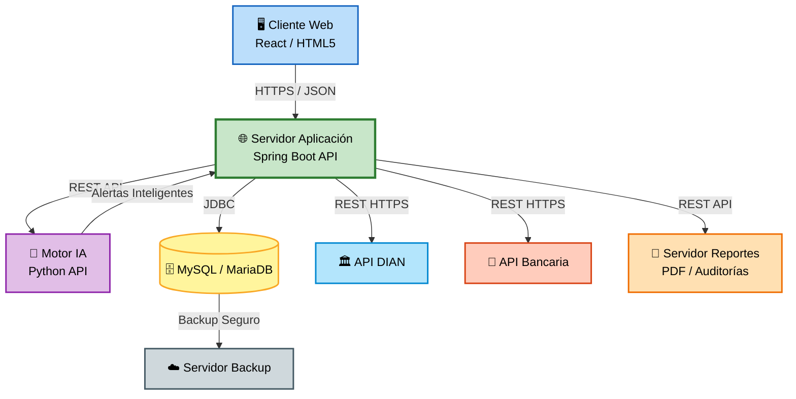

# 📘 M4 - Nodos - Protocolos - RNF

# Sistema Inteligente de Monitoreo de Facturación con IA

---

# 📌 M4 — Infraestructura de Despliegue y Comunicación

El módulo M4 representa la arquitectura física y lógica del sistema, identificando los nodos principales, protocolos de comunicación y requerimientos no funcionales (RNF) necesarios para garantizar el correcto funcionamiento del sistema de monitoreo inteligente de facturación.

Este módulo define cómo interactúan los componentes tecnológicos dentro de la infraestructura del sistema.

---

# 🌐 Nodos del Sistema

| Nodo | Descripción | Tecnología |
|---|---|---|
| 🖥️ Cliente Web | Interfaz utilizada por usuarios y administradores | React / HTML5 |
| 🌐 Servidor Web | Gestiona peticiones HTTP y autenticación | Spring Boot |
| 🤖 Motor IA | Procesa análisis inteligentes y detección de anomalías | Python IA API |
| 🗄️ Servidor Base de Datos | Almacena información del sistema | MySQL / MariaDB |
| 🏛️ Servicio DIAN | Validación de facturación electrónica | API Externa |
| 🏦 Servicio Bancario | Validación de pagos electrónicos | API REST |
| 📦 Servidor de Reportes | Generación de reportes PDF y auditorías | JasperReports |
| ☁️ Servidor Backup | Respaldo y recuperación de información | Cloud Storage |

---

# 🔗 Protocolos de Comunicación

| Protocolo | Uso Principal |
|---|---|
| HTTP/HTTPS | Comunicación cliente-servidor |
| REST API | Integración entre servicios |
| JSON | Intercambio de datos |
| JDBC | Comunicación con base de datos |
| TLS/SSL | Seguridad y cifrado |
| TCP/IP | Comunicación de red |
| OAuth/JWT | Autenticación y autorización |
| SMTP | Envío de alertas y notificaciones |

---

# 🏛️ Diagrama de Nodos

---

# 📋 RNF — Requerimientos No Funcionales

| Código | Requerimiento No Funcional |
|---|---|
| RNF01 | El sistema debe garantizar disponibilidad 24/7. |
| RNF02 | El sistema debe utilizar conexiones seguras HTTPS. |
| RNF03 | El tiempo de respuesta no debe superar 3 segundos. |
| RNF04 | El sistema debe soportar múltiples usuarios concurrentes. |
| RNF05 | La información debe almacenarse de forma segura y respaldada. |
| RNF06 | El sistema debe implementar autenticación mediante JWT. |
| RNF07 | El sistema debe registrar auditorías de acceso y acciones. |
| RNF08 | El sistema debe ser escalable y modular. |
| RNF09 | El sistema debe contar con recuperación ante fallos. |
| RNF10 | El sistema debe integrarse con APIs externas mediante REST. |
| RNF11 | El sistema debe garantizar integridad de los datos. |
| RNF12 | El sistema debe permitir monitoreo y generación de reportes. |

---

# 🔒 Seguridad Implementada

## Medidas de Seguridad

- ✅ Autenticación mediante JWT.
- ✅ Comunicación cifrada HTTPS/TLS.
- ✅ Control de acceso por roles.
- ✅ Validación de sesiones.
- ✅ Respaldo automático de información.
- ✅ Auditoría de eventos críticos.
- ✅ Protección de credenciales cifradas.

---

# 🎯 Objetivo del Módulo M4

El módulo M4 tiene como finalidad definir:

- La infraestructura tecnológica del sistema.
- Los nodos físicos y lógicos.
- Los protocolos de comunicación.
- Los requerimientos no funcionales.
- La seguridad e interoperabilidad del software.

Garantizando así un sistema:

- Seguro.
- Escalable.
- Modular.
- Disponible.
- Eficiente.
- Preparado para integración inteligente mediante IA.