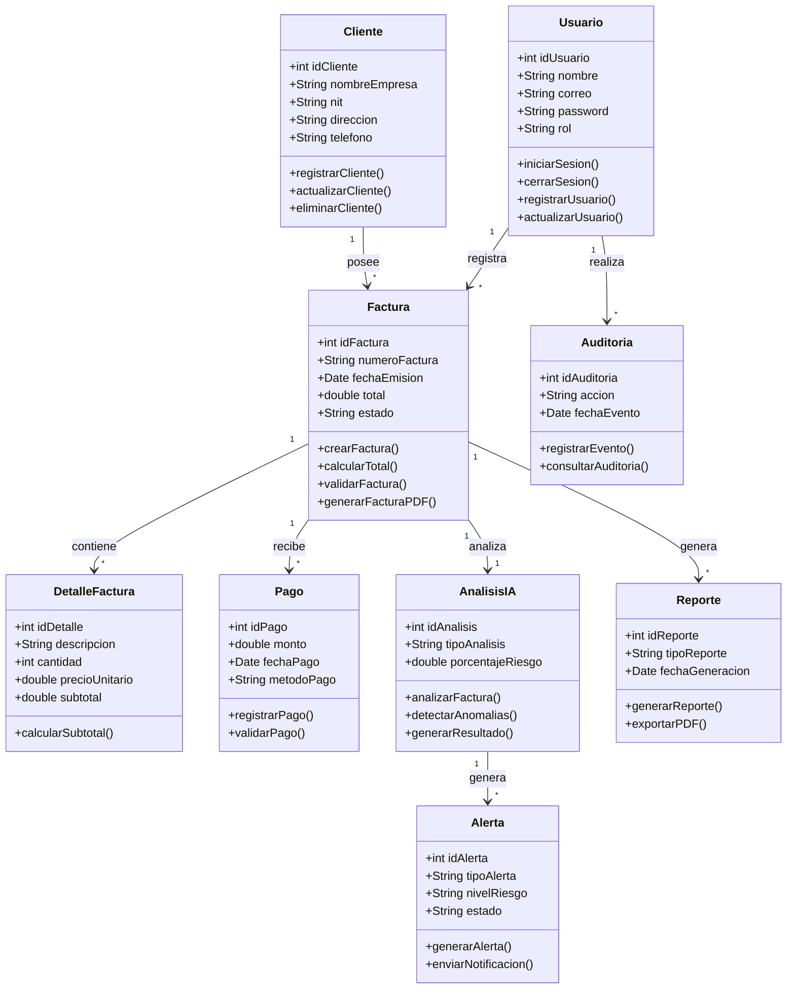
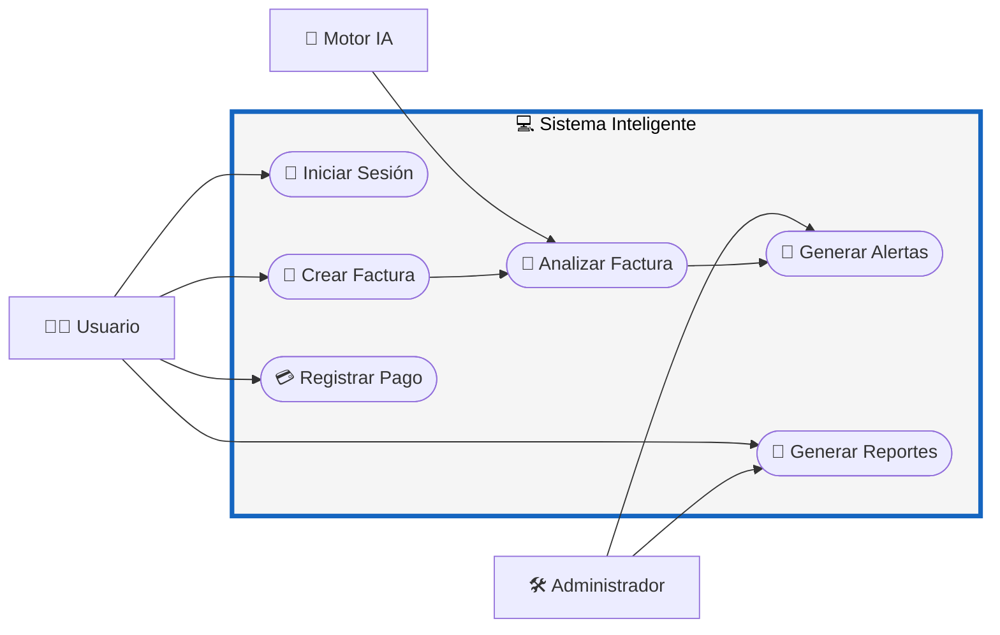

# 📘 M9 - Clases - Métodos - CU - RF

# Sistema Inteligente de Monitoreo de Facturación con IA

---

# 📌 M9 — Modelo de Clases y Métodos del Sistema

El módulo M9 representa la estructura orientada a objetos del sistema, mostrando las principales clases, atributos, métodos y relaciones que conforman el funcionamiento interno del software.

Este modelo permite organizar la lógica del sistema bajo principios de encapsulamiento, modularidad y reutilización de código.

---

# 🧩 Diagrama de Clases

---

# 🏛️ Descripción de Clases

| Clase | Descripción |
|---|---|
| Usuario | Gestiona acceso y administración del sistema |
| Cliente | Almacena información de clientes |
| Factura | Controla la gestión de facturación |
| DetalleFactura | Registra productos o servicios facturados |
| Pago | Gestiona pagos realizados |
| AnalisisIA | Ejecuta análisis inteligentes |
| Alerta | Gestiona anomalías y alertas |
| Auditoria | Registra eventos y acciones |
| Reporte | Genera reportes administrativos |

---

# ⚙️ Métodos Principales

| Clase | Método | Función |
|---|---|---|
| Usuario | iniciarSesion() | Autenticar usuario |
| Factura | crearFactura() | Registrar nueva factura |
| Factura | calcularTotal() | Calcular total facturado |
| Pago | registrarPago() | Registrar pagos |
| AnalisisIA | detectarAnomalias() | Detectar irregularidades |
| Alerta | generarAlerta() | Generar alertas automáticas |
| Auditoria | registrarEvento() | Registrar acciones del sistema |
| Reporte | exportarPDF() | Exportar reportes |

---

# 👥 CU — Casos de Uso Asociados

## 📊 Diagrama de Casos de Uso

---

# 📋 RF — Requerimientos Funcionales Relacionados

| Código | Requerimiento Funcional |
|---|---|
| RF01 | Registrar facturas electrónicas |
| RF02 | Gestionar usuarios y autenticación |
| RF03 | Analizar facturas mediante IA |
| RF04 | Generar reportes financieros |
| RF05 | Detectar anomalías automáticamente |
| RF06 | Registrar pagos |
| RF07 | Gestionar detalle de facturas |
| RF08 | Generar alertas inteligentes |
| RF09 | Registrar auditorías |
| RF10 | Gestionar clientes |

---

# 🎯 Objetivo del Módulo M9

El módulo M9 tiene como finalidad representar la estructura orientada a objetos del sistema, permitiendo:

- Organizar la lógica de negocio.
- Definir responsabilidades de clases.
- Facilitar mantenimiento y escalabilidad.
- Implementar principios de programación orientada a objetos.
- Integrar procesos inteligentes mediante IA.
- Mejorar la reutilización y modularidad del código.